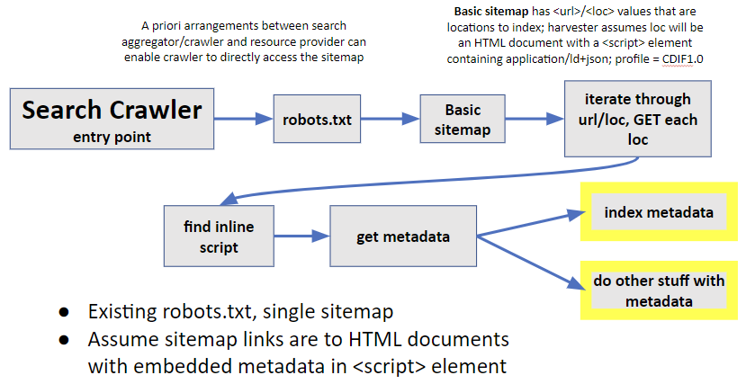
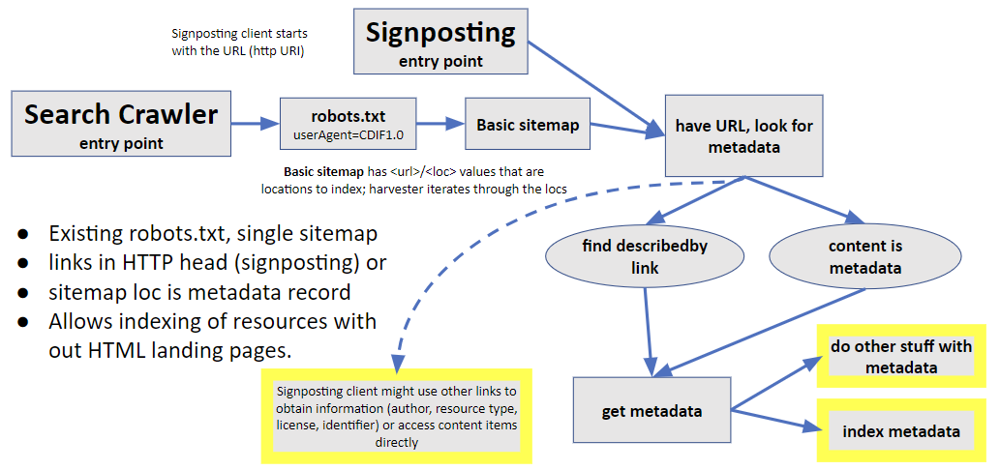

# Discoverability

Draft 2023-07-12
CDIF Discoverability workgroup.

In order for resources to be discoverable on the Web, the search applications that are used to find things must locate some representation of the resource, and must be able to parse that representation to index for searching. In the realm of linked HTML web pages, search engines parse the text content of web pages to create text-based indexes, and use links on the pages to find other pages. This approach does not work for datasets, images, sound recordings, videos, and other non-narrative text resources, so separate representations of their content are constructed as metadata, in a format that can be parsed and indexed by search applications. This pattern is also applied to text resources to to provide more explicit documentation. At the simplest level this metadata can consist of text describing the resource and a link to access the resource, analogous to what is included on the cards in a legacy library card catalog. Representing the metadata content using a structured, machine-readable format makes the information more precise and accessible to software agents. 

In the digital world, a wide variety of metadata schemes have evolved for describing resources. These schemes are structured to allow a richer understanding of the information, and typically at least include information about the set of fifteen generic elements identified as the Dublin Core: Creator, Contributor, Publisher, Title, Date, Language, Format, Subject, Description, Identifier, Relation, Source, Type, Coverage, and Rights, first drafted at a 1995 meeting in Dublin, Ohio[^1]. These elements are defined at an abstract level, and served well with free text content values for use by humans. Such semi-structured metadata is insufficient to support programmatic reuse of the described resources; automation requires precise syntax and encoding of information. Thus the CDIF provides recommendations for metadata practices compatible with machine processing.

The use of standardized metadata to describe resources is one facet of discoverability, but mechanisms to make these metadata descriptions discoverable by search applications or other machine agents is also necessary. Search application harvest metadata to index and present in search results. In other cases a machine agent might have an identifier for a resource on the web and want to get its metadata to learn about the content and capabilities of the resource. This document first discusses the metadata content requirements to enable these scenarios, then approaches to make the metadata findable, and finishes with . Appendix 1 documents a recommended CDIF metadata serialization format using the schema.org vocabulary and JSON-LD.
.

.

.

.

.

.

.


# Metadata content

In order to be machine actionable, the structure, syntax, and element-value representations in a metadata document (a digital object) must conform to conventions that client software can be programmed to parse and 'understand'. 'Understand' in this context means recognize the incoming bitstream content and take appropriate, useful action. The metadata provider must communicate the conventions used to serialize the metadata they provide. Ideally this is done with an identifier for a specification document that details the conventions used. Some widely used metadata specifications include DCAT, DataCite, ISO19115, EML, FGDC CSDGM, CERIF, schema.org, and DDI. These specifications determine the structure and syntax of metadata documents, but leave latitude on how the values of some metadata elements are represented, and often offer multiple valid approaches to representing the same information. Achieving the level of metadata interoperability required for CDIF will require the adoption of one (or a small number) of these specifications, along with more specific conventions on vocabularies used for metadata properties. We refer to such a set of specific conventions as a profile.

## What is a metadata profile?

A metadata profile is a specification for the machine-actionable serialization of metadata information in some context. This specification includes the base file MIME-type, an information model for the metadata content, and how that information is represented both syntactically and semantically. Most profiles are based on an existing metadata specification, e.g. schema.org, DCAT, ISO19115-1, EML, DDI-CDI, but provide additional detail to resolve ambiguities in the base specification, or rules for vocabularies and datatypes for element values that extend or restrict the base specification. The simplest presentation of a profile specification can be a text document that describes the information required, identifies the base specification, and states any conventions or rules for profile conformance. Such a document could be used by a software developer writing code to use information in metadata conforming to the profile. Profiles might also be specified in a machine-actionable way, e.g., the Dublin Core Tabular Application Profiles (DCTAP)[^dctap], Profiles Vocabulary[^prof], SHACL rules[^shaq], XML schematron rules[^sctr], or other schema or rule representations. Using a rule-based representation for metadata profiles provides an approach to defining and communicating metadata constraints that can be validated automatically to support metadata profile interoperability, reusability, and quality.

CDIF defines a metadata profile for interoperable data discovery. To start, the content requirements are described, then we review the relationship to the Fair Digital Object Framework and the metadata requirement that framework entails. The metadata implementation outlined in Appendix 1 is based on these requirements.

# <a name="mdcontent" a/> Metadata Content Requirements

Explanation of fonts used: *Terms in italics are groupings of metadata properties*; **required (not nilable)**, **required (nilable)**, and **recommended** but optional metadata content; number of values that can be <span style="color: gray;">specified are in gray</span>.

The following list includes the minimum required content for basic resource description, discovery, and access. This recommendation is a synthesis of various metadata schemes, including ISO19115-1, schema.org conventions from ESIPFed Science on Schema.org and Ocean Data net, DCAT, DCAT-AP, and FDO Kernel Attributes-2.0[^2] . A mapping between the various scheme and these CDIF content elements is available in a Google Spreadsheet[^3] .

Note that these content requirements are scoped for a broad spectrum of resource types. It is expected that other fields will need to be added in extensions for specific kinds of resources.

## Required 

If these elements do not provide useful information, the metadata is considered useless for even the most rudimentary discovery use cases. Conformant metadata MUST provide valid values, i.e., a meaningful title that identifies the resource, either a URL or text statement of how to obtain the resource, a statement of any licensing, usage or access constraints (Rights), and identifiers for the specification of the metadata serialization and the type of the resource described.

> **Resource identifier** (**1 entry**): A globally unique, resolvable identifier for the resource described by the metadata record.
>
> **Title** (**1 entry**): Succinct (preferably \<250 characters) name of the resource; should be sufficient to uniquely identify the resource for a human user.
>
> **Distribution:  URL, Distribution object,** or **Access Instructions** (**1 entry**): If the resource is a digital object accessible online, provide a URL that will retrieve the resource. If the resource has multiple representations, provide a Distribution Object documenting the various options with a URL and representation profile for each. If it's not accessible online, provide a URL to a landing page used to access the resource, or minimally, provide a text description explaining how to access the resource in the metadata (Access Instructions).
>
> **Rights** (**1 to many entry**): Information about required access permissions, licenses, contractual requirements, use constraints, and security constraints. Might be described in text or through links to external documents.
>
> **Metadata profile identifier** (**1 to many**): Identifier for metadata specification (profile) used to create this metadata record. Generally this will be populated automatically if the metadata is created using CDIF aware tools.
>
> **Resource type** (**1 to many**): A scoped name (label with classification scheme) that specifies the kind of resource described by the metadata. The resource type might be used to determine validation requirements specific to descriptions for that kind of resource.

## Required, but nilable

Content elements for which every resource should have useful information, but for which the information may not be available. Must be included in metadata record, but may have value \'nil:missing\', 'nil:unknown' or similar nil value. Use \'nil:notapplicable\' for Temporal Coverage, Geographic Extent or Variable Measured when these are not applicable to the described resource.

> o **Description** (**1 entry**): Inform the reader about the resource\'s content, context, provenance, and any other information deemed useful for future cross-domain usage.
>
> o **Originators** (**1 to many entries**): Agent object that specifies responsible party in some role related to the resource, e.g., author or editor.
>
> o **Modified Date** (**1 entry**): Date (not temporal extent) when any changes to the resource were completed. Use a \"year\" or [ISO 8601 date and time] format. Alternative date formatting must be machine-readable and consistent across all datasets.

> o **Distribution Agent** (**1 entry**):The party (name of organization or person, etc.) to contact about accessing the resource. Agent object includes a name (label), identifier, and optional contact information. If there are multiple distribution options with different contact points, the Distribution Agent should be specified as part of the Distribution Object.

> o **Variable Measured** (**0 to many entries**): Only applicable to datasets.  A complete description of a dataset should include a list of the fields in the data, with each field mapped to a variable that is represented by the content of that field. Variable definitions should minimally specify the property represented by name. Identification of the property represented with a resolvable URI is strongly recommended. Details of data structure and schema are discussed elsewhere the CDIF document portfolio because they are more closely related to interoperability and usage that to data discovery. 

> o **Temporal Coverage** (**0 or 1 entry**). The time period represented by the described resource. This could be the time interval when data were collected, or an archaeological or geological time period that is the subject of the resource. Need to account for clock time, calendar time (Gregorian, Julian, Hebrew, Islamic, Chinese, Mayan\...), cyclical time (summer, first quarter, mating season, new moon, pay day) and for named time ordinal eras (Jurassic, Younger Dryas, Early Minoan I, Late Stone Age). See OWL Time.
>
> o **Geographic Extent - horizontal** (**if applicable,  1 entry, minimum bounding rectangle or point**): Location coordinates must be given in decimal degrees using the [WGS 84] datum. Some resources may not be usefully described by a WGS 84 extent, in which case indicate nil:notapplicable; this would include extraterrestrial resources.

-   Bounding Rectangle: **North Bounding Latitude, South Bounding Latitude, East Bounding Longitude, West Bounding Longitude**. The minimum rectangle that completely contains the coverage extent for the resource content. Coordinate order and syntax are determined by the serialization profile.

-   Point: **Latitude, Longitude**. A centroid point for the coverage extent of the resource, or the location of the resource content if a point location is appropriate. Coordinate order and syntax are determined by the serialization profile.

-   Named location: Place name referenced to some gazetteer. Use scoped name pattern {label, authority, optional identifier}.

## Required for metadata management

These elements provide essential information for the operation of a distributed catalog system with harvesting of metadata between catalog servers. Values should be populated automatically by metadata creation tools, requiring no user input. Nil values are allowed.

> o **Metadata Date** (**1 entry**): Last metadata update/creation date-time stamp in [ISO 8601 date and time] format. This may be automatically updated on metadata import if a metadata format conversion is necessary.
>
> o **Metadata Contact Agent** (**1 entry**): The party responsible for metadata content and accuracy; Agent object includes a name (label), identifier, and optional contact information
>
> o **Metadata Identifier}** (**1 entry**): The identifier for the Digital object that contains the metadata.

## Recommended

Other properties that should be specified if possible and relevant. All are optional.

-   **Checksum.** (**0 or 1**): A string value calculated from the content of a digital object that allows verification that the content of the object has not been modified. Even small changes to the content of the file will change its checksum. The algorithm used to calculate the checksum must be documented. See also rfc6920 'Naming things with hashes' that establishes ways to identify checksum algorithms and to represent checksum values as a URI. Note that checksums apply to specific digital objects, typically a unique resource representation. Non-digital resources do not have checksums; their representations can have checksums. See implementation notes in [Appendix 1](#appendix-1).

-   **Funding.** (**0 to many entries**): Cite funding sources (Grants, contracts\...). Each source has a grant or contract identifier, source organization, and label.

-   **Keyword** (**0 to many entries**): Distinguish 'tags' and 'controlled terms'. Tags are simply words that a metadata creator thinks will be useful for users to identify resources of interest. Controlled terms are words defined in a vocabulary that minimally include the word (a fixed string to identify the term for humans) and a definition. Each term represents some concept. More semantically rich vocabularies would include resolvable identifiers, source information, and links to related terms (see [Ten simple rules for making a vocabulary FAIR](https://doi.org/10.1371/journal.pcbi.1009041)). One common set of relationships in a vocabulary is a kind-of hierarchy linking broader to narrower concepts. Controlled terms should minimally be represented in metadata with a label and scheme name that identifies the source vocabulary; ideally a term URI and scheme URI could be included for more accurate identification and data integration.

-   **Policies** (**0 to many entries**): Policies used in management of the described resource, including whether the content may be changed (mutable or immutable), any scheduled updates, what is the expected life time for resource availability, what (if any) is the maintenance schedule, versioning, documentation for changes and change requests.

-   **Publication Date** (**0 or 1**): Date (not temporal extent) when the resource was made accessible. Use a \"year\" or [ISO 8601 date and time](https://en.wikipedia.org/wiki/ISO_8601) format. Alternative date formatting must be machine-readable and consistent across all datasets. If no publication date is known, estimate the publication date range, enter the oldest year as the publication date, and include the estimated date range in the Description field.

-   **Other related agents** (**0 to many entries**): Recognition for others who have contributed to the production of the resource but are not recognized as authors/creators. Includes a variety of roles like editor, maintainer, publisher, point of contact, copyright holder, contributor (see e.g. [DataCite contributor types](https://datacite-metadata-schema.readthedocs.io/en/4.5_draft/properties/recommended_optional/property_contributor.html#a-contributortype), [ISO19115-1 role code](https://wiki.esipfed.org/ISO_19115-3_Codelists#CI_RoleCode))

-   **Related resources** (**0 to many entries**): Links to related data, publications, annotation, data sources, software used, etc. Links have at least a label, relationship type, and resolvable target resource identifier.

-   **Version** (**0 or 1**): If the resource is versioned, specify the label for this version. Version labels should follow a scheme that allows alphanumeric sorting reflecting the order of version release.

# Digital Objects

A resource is some identifiable thing of interest to someone; it might be a Digital Object (DO) or a Non-digital Resource. The Digital Object bitstream might be the resource of interest, or it might be a representation of an abstract or physical resource that cannot be transmitted electronically (see HTTP Range-14[^http14]). The identifier for a Digital Object can be dereferenced to access the object directly. A non-digital resource is a material entity (e.g. person, rock sample), an abstract entity (e.g. Donald Duck, The Land of Oz), or a \'Work\' or 'Expression' in the FRBR sense[^frbr] (e.g. Beethoven's 9th symphony, Dickens' Tale of Two Cities). Identifiers for Non-digital Resources must dereference on the web to a DigitalObject that is a representation of the non-digital thing and can be transmitted electronically.

In the Fair Digital Object Framework (FDOF) a Digital Object (DO) is a specific bit stream that carries some information and has a **persistent, registered, resolvable identifier** (PID) that can be resolved to obtain a PID kernel record providing documentation for the source of the PID, expected lifetime, type of resource it identifies, linkage to the resource it identifies, and other attributes specified in a schema identified in the PID kernel record (PID profile)[^7]. The PID kernel record is a metadata record conforming to a particular PID profile. Digital Objects are FAIR (FDOs) when they are part of an ecosystem comprising services and infrastructure to support realization of the FAIR principles. In the Fair Digital Object Framework (FDOF) there must be a mechanism to access either the object or its metadata by dereferencing the object's PID.  Metadata content must enable the identified resource to be found, used and cited, enable interoperability and reuse, and include machine-actionable statements about dependencies and licensing. Bonino et al., 2022[^boni22] propose some approaches to access the FDOFIdentifierRecord (Kernel metadata) and other FDOF requirements; the level of adoption for this approach is uncertain. 

 Figure 1. FDOF-CDIF metadata relations
.

.

.

.

# Signposting

Signposting is an approach to discovering the content and capabilities of resources accessed by resolving URIs on the Web. Like the Fair Digital Object framework, it starts with an identifier that can be resolved, and uses typed web links (IETF RFC8288[^8288]) and IANA registered relationship[^rel] types to enable an agent to quickly see what is identified and navigate to metadata with more information. As is outlined in van de Sompel (2021)[^vds21], these signposting links can implement the linking requirments of the Fair Digital Object Framework. 

Figure 1 provides a view of the relationship between CDIF metadata and discovery concepts. From the CDIF discovery perspective, a user (human or machine) searches for resources containing the information they need ('Resource' in the diagram), and subsequently considers whether the digital object(s) containing or representing the resource are useful for their application. The MetadataRecord associated with a Resource (hasMetadata or describedby relationship) provides the information to support discovery and evaluation, and access in this approach. In the FDO and Signposting perspective, a user (especially a machine agent) starts with an identifier (PID) for a digital object (FDOF PID in the diagram), and seeks to understand what it is about, how it is formatted, and what can they do with it. This is done by accessing the FDOFIdentifierRecord (Kernel metadata) and then, if necessary, the full metadata record, perhaps using Signposting links using a profile parameter for FDOF metadata on a rel=describedby link. 

The CDIF metadata requirements outlined above include recommended or optional properties necessary to create a FDO PID Kernel information record (FDOFIdentificationRecord in Figure 1, above) as recommended by the Research Data Alliance (RDA)[^weigel]. The mapping from the PID Kernel information record to the CDIF metadata schema.org recommended implementation is shown in Appendix 2. Mapping from Signposting link relation types to CDIF metadata elements is shown in Appendix 3. Thus, Signposting can be used to implement FDOF requirements, and in the following implementation discussion we outline how Signposting is compatible with CDIF.

## <a name="impapp" a/> Implementation approaches

As a starting point, the resources of interest must be documented with metadata content that meets the requirements outlined in the [Metadata Content Requirements](#mdcontent) section, and is serialized following the CDIF schema.org profile *(currently in [Appendix 1](#appendix-1), likely to move to a separate document)*. Given that the metadata follows CDIF conventions, software can be written to extract information to enable client actions, whether that is populating a search index or accessing a useful resource representation. The workflow is reviewed here, and then discussed in more detail below.

Finding documents to index: Web-crawling is still an important approach to finding and indexing resources on the web, and this approach is supplemented by Signposting. A different and widely used approach is the sitemap, which is a list of web locations (URLs) for files that a hosting agent wants search engines to index. Many search engines enable providers to register sitemap locations. Alternatively, root directories on web servers can use a 'robots.txt' file to point to one or more sitemaps that should be indexed.

Getting the metadata: Once a crawler for a search application finds a document that should be indexed, the question is where is the metadata to index, and what conventions does the metadata use. There are several approaches:

1.  Each resource has an html landing page that describes the resource for human users, and contains embedded CDIF JSON-LD metadata (See [Appendix 1](#appendix-1)) for machine clients. Metadata can be embedded in landing pages using the HTML \<script\> element, in alignment with the Data on the Web Best Practices, specifically section 8.2, Metadata[^10]. This approach requires that each published resource has a human-readable landing page, intended to be the target of search by human users. Scripts are normally embedded in the \<head\> section of an HTML document. The \<script\> element has at minimum a 'type' attribute that provides a MIME-type specifying the type of script.

 Example 1. A JSON-LD metadata object embedded as a script in an HTML document.

2.  Metadata can be embedded in the HTML \<head\> section of a landing page using HTML \<meta\> elements, which have a 'name' attribute that can be used to identify different metadata properties (see example below). This approach is implemented by some off-the-shelf repository software (e.g. Dataverse). The HTML \<meta\> elements are intended to describe the HTML document that contains the \<meta\> element[^11], not some external resource that the web page is about. CDIF recommends against this approach and suggests using the script approach (No 1 in this list) instead because that is more widely used and allows richer metadata content to be included.

 Example 2. HTML meta tags with metadata about a resource.

3.  Metadata can be linked from the landing page using the HTML \<link\> element in the \<head\> section to provide a web locator (URL) that can be used to retrieve a full metadata document about the described resource. The link element has the "rel='describedby'" attribute to indicate that the link is to metadata, a 'type' attribute to provide the MIME type of the target metadata record, and optionally a 'profile' attribute to identify specific metadata conventions. Note that multiple links could be provided to diffent metadata views, e.g. a CDIF record, a PID Kernel record, a FDOFidentifierRecord, etc. This approach depends on web-crawlers identifying and following these links to get the metadata that the provider wants indexed. This is one of the Signposting approaches[^12].

4.  The server providing the resource can be configured to include \<link\> elements in the HTTP header[^13] that indicate the location of machine-actionable metadata describing the subject of URL target. As in the HTML link approach, these links would have a "rel='describedby'" attribute to indicate that the link is to metadata, a 'type' attribute to provide the MIME type of the target metadata record, and optionally a 'profile' attribute to identify specific metadata conventions. The advantage of this approach is that the HTTP header links can be provided for any resource that has an HTTP URL, so the links to metadata can be accessed for non-textual resources that do not have an associated HTML landing page. If the download size for the resource is large, a client can use the HTTP 'head' request to access this header information without downloading the entire file[^14]. This approach would enable indexing of large resource collections that have a single landing page, but for which the individual resources do not have a landing page. The downside is that many client applications do not use the HTTP header information[^15]. This is a second Signposting approach. CDIF recommends this approach for resources that do not have landing pages; see implementation details below.

5.  A sitemap can point directly to metadata documents in formats that the search engine can parse. With the basic sitemap XML schema, all metadata would need to conform to a single profile. In the implementation section below, the CDIF proposes using an extension to the sitemap scheme that allows labeled links to the indexing targets.

6. Another option is for the sitemap to provide a URL that retrieves a document containing a collection of metadata records, something like the US Government Data.gov Project Open Data Catalog[^16], or Ocean Info Hub graph first approach[^17], with individual records using CDIF JSON-LD. 

*How do harvesters know where to look?*

-   Publishers register metadata services with a harvester, e.g. providing a URL to GET a sitemap or other metadata catalog document, e.g. an OpenGeospatial Consortium (OGC) Record collection (catalogue).[^18]

-   Server robots.txt has link to sitemap.xml file; The sitemap.xml lists web locations that a crawler should index.

Once the harvester has a URL for a location to index, how do they know where the metadata is relative to that location? There are several approaches:

-   Try a [HTTP HEAD request](https://www.rfc-editor.org/rfc/rfc9110#HEAD) on the URL and inspect. If the Content-Type header value is a known metadata type and profile, then the URL will get a document containing a single metadata record that can be indexed. Failing that the client can look for links in the HTTP header; if there is a link with rel='describedby', with a known type and profile, get the content at that link. 

-   GET the content at the URL. Look for a <script> element with a known type and profile. Failing that look for <link> elements with rel='describedby' and a known type and profile, then get the content at that link.  

This general procedure can be simplified if the sitemap or other catalog the harvester is iterating through provides labeled links.

*What does the harvester do with the metadata?* There a many possible approaches a client application could use to extract the information it needs from a metadata record. The simplest and likely most accurate approach is for the metadata to conform to a profile that the application is programmed to parse, and to communicate that profile conformance to the application. This entails two requirements. The profile must be documented in a way that allows software developers to write code to parse metadata conforming to the profile, and the profile must have an identifier that can be used to assert conformance.

The use of \<script\> or \<link\> elements (in the HTTP or HTML header) allows metadata to be offered following multiple specifications with  the 'type' and 'profile' attributes used to identify the particular conventions.[^cprf]. 

  
*Example 3. Script type with a type parameter in the MIME type string.*

Minimally, the metadata record should assert the specification used to generate the record in a metadata property.
.

.

.

.

.

.

.

.

.
# CDIF Recommendations:

## Scope 

These recommendations are intended to be applicable for publication of metadata on the web to support a basic level of discovery interoperability for static resources with or without associated landing pages. Resources accessible via APIs that support functionality beyond simple static resource retrieval, e.g. subsetting, filtering, data transformations, or negotiation transactions related to security or confidentiality, are out of scope. Future work will define levels of conformance for more sophisticated functionality. For the CDIF, we recommend conventions for 1) what conventions ('standards') should be used so that the metadata is machine actionable; 2) how crawlers find documents to index or use; 3) how metadata is incorporated in or accessed from those documents. The content recommendations and implementation outlined in [Appendix 1](#appendix-1) cover the first of these topics. The second and third topics are discussed here.

### Publishing metadata

Figure 2 (below) is a flow chart showing the recommended decision tree for metadata publishers to determine how to expose their metadata. Numbers in the following discussion refer to numbered boxes in the diagram.

 
*Figure 2. Decision graph to determine where metadata is located, from the resource publisher's perspective. Steps are numbers and referenced in text.*  

#### Option 1. Embedded in HTML

Starting at the top (1), if there are HTML landing pages that describe the resources of interest, and the metadata publisher has the necessary authority to update the content of these pages, then CDIF metadata should be embedded in an HTML \<script\> element in the \<head\> section of each landing page (3). The script should have the following type and profile attributes:

*type=\"application/ld+json\" profile=\"CDIF1.0\"*

#### Option 2. Individual metadata file URLs

If the resources of interest do not have individual landing pages, or the metadata publisher does not have authority to update the content of landing pages, the metadata should be placed in a web-accessible location (step 4 in Figure 2). There are two common approaches:

-   Each metadata record is accessed in a separate, static file with its own URL. The CDIF metadata is serialized as JSON-LD (see [Appendix 1](#appendix-1)). MIME type for the metadata file, returned as the Content-Type parameter in the HTTP response header, is:

*type=\"application/ld+json\" profile=\"CDIF1.0"*

-   Each metadata record is accessed dynamically from the server using a URL.There are various open-source metadata server systems that can be configured to deliver CDIF metadata from the server's metadata database, e.g. GeoNetwork OpenSource[^19], GeoPortal[^20], CKAN[^21]. The metadata retrieval URLs have different syntax depending on the software used, but typically include a metadata record identifier and a format parameter that would be used to indicate that CDIF metadata should be returned. If there is a format parameter in URL requests, its value should be '**CDIF1.0**'.

#### Option 3. Metadata list file

-   A collection of metadata records are gathered in one file accessed using a single URL. For CDIF, this file should contain a set of CDIF JSON-LD metadata objects, implemented as a schema.org ItemList[^22]. See example in [Appendix 1](#example-3-item-list-with-a-collection-of-metadata-records). The MIME type for the collection is:

*type=\"application/ld+json\" profile=\"CDIF-list-1.0"*

### Find metadata

CDIF recommends the use of sitemaps to address the questions of how crawlers find metadata to index or use. A sitemap[^23] is an XML document that a metadata crawler or harvester can access (6 in Figure 2). The basic sitemap is an XML document that is a structured list of URLs, with an optional date stamp property that should indicate when the metadata at the URL target location was last updated. The most basic CDIF recommended approach for resources that have landing pages that can be modified is Option 1 outlined above. The workflow for a harvester in this approach corresponds to existing structured data on the Web practice, with metadata conforming to the CDIF recommendations. Existing robots.txt and sitemap files can be used, and no modifications need to be made to HTTP headers provided by resource servers.

 

*Figure 3. Basic harvesting pattern; sitemap with locations that contain HTML documents with embedded CDIF metadata*  

If resources do not have landing pages, or the landing pages can not be modified, harvesters must be provided with links to the metadata records to index. The basic approach for this next level of service is similar, but the harvester can not assume that the metadata is embedded in the content accessed from the sitemap url/loc. The sitemap url/locs must either get the metadata document directly, or it might get the resource content directly. In the second case, a url to get the metadata must be included in the HTTP response header.  Because the basic sitemap only provides a url, the harvester will need to check which of these options is being used. The approach using standard web architecture is to inspect the HTTP response header.  If the returned document is a CDIF metadata document, the header will have a content-type parameter with the value "*application/ld+json; profile='CDIF1.0'*" or *profile='CDIF-list-1.0'* if the document is an itemList with multiple metadata records. The harvester should get the content at the sitemap url/loc and use that. If the content-type has a different value, then the header should have link element with *rel='describedby'*, *type='application/ld+json'*, and *profile='CDIF1.0'* or *profile='CDIF-list-1.0'*. In this case, the harvester will GET the content at the link href and use that.  Inclusion of the describedby link in the HTTP header is the pattern used by Signposting. Note that other Signposting links (see [Appendix 3](#appendix-3)) could be inserted into the HTTP response headers (or HTTPlanding pages if they exist) if web site administrators allow. This can provide additional values for clients implementing signposting. 



*Figure 4. Harvesting pattern for locations that do not have embedded metadata scripts. Either the url/loc content is a metadata document (JSON-LD, CDIF profile), or there is a Signposting link with rel=describedby in the HTTP head. To indicate that this is not a standard sitemap, the robots.txt link to the sitemap should identifie CDIF1.0 as the userAgent.*  

Note that in this second case, the sitemap url/loc locations will get content that is not HTML. A non-CDIF aware harvester will be expecting HTML (or indexable text) content, and in some situations this might cause problems. Harversters will generally find the sitemap using a link from a robots.txt[^robot] file placed in the root of the server containing the sitemap and metadata. In the robots file, the user agent value can be used to indicate a sitemap link for CDIF-aware agents in cases for which the sitemap links are not to pages that have embedded CDIF metadata <script> elements.  If the harvester accesses a sitemap under this user agent, the url/loc location content should be processed as outlined in the last paragraph.

```
User-agent: CDIF1.0
Sitemap: http://www.example.com/CDIFsitemap.xml
```

Based on these recommendations, metadata generated using the CDIF content and serialization can be found and harvested by agents using standard off the shelf web technology.
.

.

.

.

.

# Definitions:

Definitions in this section follow the conventions outlined in ISO704[^25]. Definitions are derived through interpretation of Fair Data Object Framework documents[^26] and Kahn and Wilensky[^27], unless otherwise noted.

**digital object** \-- packaged, identifiable sequence of digital bits that carries some information. A digital object has exactly one digital representation.

**Fair Digital Object** \-- **digital object** in the context of a system of policies and infrastructure to support realization of the FAIR principles.

**identifier** (CDIF) \-- an association between a sequence of bits and a unique resource of interest[^28]. Typically represented as a sequence of characters. NOTE: identifiers lose value if there is no clear, unambiguous specification of what they identify.

**persistent identifier** \-- **identifier** that has the intention that its binding is to the precise same resource for the lifetime of systems using the identifier

**PID** - **persistent, registered identifier** that can be resolved to obtain a **PID kernel record**.

**PID kernel record** - **digital object** that provides documentation for the source of the PID, expected lifetime, linkage to the resource it represents, and other attributes specified PR-KernelAtributues-2.0[^29].

**PID profile** - **digital object** that provides the definition of the protocol for obtaining the **PID kernel record** given the **PID**, and the definition of the schema for the content of the PID kernel record.

**PID registration** - binding between a **PID** and a **PID kernel record** that provides documentation for the source of the PID, expected lifetime, and linkage to the resource it represents. To be useful, there must be an a-priori known community practice for obtaining the PID kernel record given the PID.

**registered digital object** \-- **digital object** that has been placed in an accessible digital storage location, and assigned a **registered and resolvable identifier** that can be resolved to access the object

**registered identifier** \-- **identifier** that has been recorded in an accessible information system with its binding to the resource it identifies.

**resolvable identifier** \-- **identifier** that has a known protocol to access the resource to which it is bound. In current standard practice this is achieved using the world wide web and its associated HTTP(s) protocol.

**Semantic artefact** \-- machine-actionable, human-readable representation of an abstract, simplified view of the world[^30]

**Relation Type** **Terms**

-   describedby (schema:subjectOf)\
    > The target of the link provides metadata that describes the resource that is the origin of the link. (<https://signposting.org/FAIR/>)

-   describes (schema:about)\
    > The origin of the link is a resource that provides metadata that describes the resource that is the target of the link. It is the inverse of the describedby relation type.(<https://signposting.org/FAIR/>)

-   item (schema:hasPart, or schema:itemListElement)\
    > The origin of the link is a collection of resources and the target of the link is a resource that belongs to that collection. It is the inverse of the collection relation type.(<https://signposting.org/FAIR/>)

-   collection (schema:isPartOf)\
    > The origin of the link is a resource that belongs to a collection and the target of the link is the collection to which it belongs. It is the inverse of the item relation type. (<https://signposting.org/FAIR/>)

-   wasDerivedFrom\
    > The subject resource was created by transformation of the object resource, update (not revision) of the object resource resulting in a new entity, or the construction of a new entity based on the object resource. (based on PROV-DM[^31])

-   specializationOf\
    > The subject resource shares all aspects of the the object resource, and additionally presents more specific aspects, e.g. restrictions on property ranges, additional properties.(based on PROV-DM)

-   wasRevisionOf\
    > The subject resource is a version of the object resource that has been corrected or improved in some way. (based on PROV-DM)

-   hadPrimarySource\
    > The subject resource was produced with information from some agent (the object resource) having direct experience and knowledge about the topic of the subject resource.(based on PROV-DM)

-   wasQuotedFrom\
    > Some or all of the object resource is copied in the subject resource by someone who may or may not be its original author. (based on PROV-DM)

-   alternateOf\
    > The subject resource presents the same content as the object resource in a different expression or manifestation. (based on PROV-DM)

# Appendix 1

# Serialization of CDIF metadata 

JSON-LD has been chosen as the recommended serialization format for CDIF metadata following our principle to use existing mainstream technology. The JSON format is widely used for data serialization and popular with developers. JSON-LD adds additional syntax for the representation of linked data, compatible with existing JSON implementations so that integration with existing applications is relatively frictionless. Many metadata providers are using the schema.org[^32] vocabularies with JSON-LD serialization for metadata publication and interchange. Use of this format provides a low barrier to entry for data providers.

The JSON syntax is defined by the ECMA JSON specification[^33], and JSON-LD is specified in the JSON-LD 1.1 recommendation[^34] from the World Wide Web Consortium (W3C). This serialization is designed for linked data applications that will translate the JSON into a set of {subject, predicate, object} triples that can be loaded into an RDF database for processing. The JSON-LD context binds JSON keys to URIs for more precise semantics, and the use of URIs to identify entities and property values in the metadata will maximize the linkage with resources on the wider web to build an ever-expanding global knowledge graph.

A metadata record has two parts; one part is about the metadata record itself, the other part is the content about the resource that the metadata documents. The part about the record specifies the identifier for the metadata record, agents with responsibility for the record, when it was last updated, what specification or profiles the metadata serialization conforms to, and other optional properties of the metadata that are deemed useful. The metadata about the resource has properties about the resource like title, description, responsible parties, spatial or temporal extent (as outlined in the [Metadata Content Requirements](#mdcontent) section).

Schema.org includes several properties that can be used to embed information about the metadata record in the resource metadata: [**sdDatePublished**](https://schema.org/sdDatePublished), [**sdLicense**](https://schema.org/sdLicense), [**sdPublisher**](https://schema.org/sdPublisher), but lacks a way to provide an identifier for the metadata record distinct from the resource it describes, to specify other agents responsible for the metadata except the publisher, or to assert specification or profile conformance for the metadata record itself.

There are two patterns that could be used to structure the two parts of the metadata record:

Option 1. The root object is the described resource:

```
{   "@context": "https://schema.org",
    "@id": "ex:URIforDescribedResource",
    "@type": "ImageObject",
    "name": "Picture of analytical setup",
    "description": "Description of the resource",
    "subjectOf": {
        "@id": "ex:URIforTheMetadata",
        "@type": "DigitalDocument",
        "dateModified": "2017-05-23",
        "encoding": {
            "@type": "MediaObject",
    	    "dcterms:conformsTo": {"@id":"ex:cdif-metadataSpec"}
          },
        "about":{"@id":"ex:URIforDescribedResource"}
    }  }
```

Option 2: root object is the metadata record

```
{   "@context": "https://schema.org",
    "@id": "ex:URIforTheMetadata",
    "@type": "DigitalDocument",
    "dateModified": "2017-05-23",
    "encoding": {
          "@type": "MediaObject",
    	  "dcterms:conformsTo": {"@id":"ex:cdif-metadataSpec"}
          },
    "about": {
         "@id": "ex:URIforDescribedResource",
         "@type": "ImageObject",
         "name": "Picture of analytical setup",
         "description": "Description of the resource",
         "subjectOf":{"@id":"ex:URIforTheMetadata"}
       }   }
```
The rdf triples generated by these two approaches are identical, so if the metadata are always harvested to a triple store it makes no difference. However, allowing either approach would create interoperability problems for harvesters that are parsing the metadata as JSON\-- the paths to the same metadata elements are different in the two approaches. It is our judgment that option two above (root object is the metadata) is more consistent with knowledge graph construction, CDIF thus recommends a JSON-LD serialization in which the root object is the metadata record. If this is a problem for processing JSON-LD metadata as JSON, JSON-LD framing[^35] can be used to generate a desired, consistent JSON tree structure for processing.

The recommended basic structure of the JSON-LD file is like this (using the 'root object is the metadata' approach). This pattern is used in the examples below.:
```
{
    "@context": [
        "https://schema.org",
        {"dcterms": "http://purl.org/dc/terms/",
         "ex":"https://example.com/99152/"
        }
    ],
    "@id": "ex:URIforThisMetadataRecord",
    "@type": "DigitalDocument",
    "dateModified": "2017-02-03",
    "encoding": {
            "@type": "MediaObject",
    	    "dcterms:conformsTo": {"@id":"ex:cdif-metadataSpec"}
          },
    "about": {
        "@id": "ex:URIforDescribedResource",
         "@type": ```{the type of the described resource}```,
         "dateModified": "2014-02-23"
```
 ..... other metadata content omitted
```          }
   }
```

JSON keys prefixed with '@' are keywords defined in the JSON-LD specification[^36] (see table below)

 | Keyword  |   Description|
 |----------- |-------------|
 | \@context |  The value of the context is an object that specifies set of rules for interpreting the JSON-LD document. The rules can be specified inline in, or via a URI that identifies a context object containing a set of rules. |
|  \@id    |    A string that identifies the subject of the assertions in the JSON object that contains the \@id key.|
|  \@type   |   An identifier for the definition of the structure of the JSON object that contains the \@type key. The type determines what keys or values should be expected in the JSON object that contains the key. Values are types defined in the schema.org vocabulary. In the CDIF framework (and for compatibility with FDOF FDOF digitalObjectType), the schema:additionalType property should be used (see implementation table below) |
 


In the example above, there is a 'dateModified' metadata assertion. It would translate into a triple like this:

*ex:URIforThisMetadataRecord  schema:dateModified \"2017-02-03\"   *

Which states that the Metadata was modified (most recently) on 2017-02-23.

On the other hand, in the 'about' object, there is a statement:

*ex:URIforDescribedResource schema:dateModified \"2010-02-03\" *

Which states that the Described Resource was modified (most recently) on 2010-02-03. The distinct identifier for the metadata record allows statements to be made about the metadata separately from statements about the resource it describes. Note that the \@type for the metadata node (root node) is 'DigitalDocument'. This is a schema.org type that corresponds broadly to the concept of DigitalObject as used by the Fair Digital Object (FDO) community[^37], recognizing that the metadata record is a digital object.

### Implementation of metadata content items

The following table maps the metadata content items described in the [Metadata Content Requirements](#mdcontent) section to the schema.org JSON-LD keys to use in metadata serialization. Some example metadata documents follow. The \'Obl.\' column specifies the cardinality obligation for the property; \'1\' means one value required; 1..\* means at least one value is required; 0..\* means the property is optional and more that one value can be provided. Properties implemented with a path that starts with /\"about\" are describing the resource, properties with path from / describe the metadata.


| **CDIF content item**       | **Obl.** | **Schema.org implementation**   | **Scope note**    |
|----------- |-------------|-------------|-------------|
| Metadata identifier         | 1        | /"@id":{URI}    | The URI for the metadata record should be the \@id value for the 'subjectOf' element in the JSON instance document tree   |
| Title      | 1        | /"about"/"name":{string}     | A set of words that should uniquely identify the described resource for human use, in the scope of the metadata catalog containing this metadata record.     |
| Distribution        | 1        | /"about"/"url":{URL}       | If metadata is about a single digital object      |
|             |          | /"about"/"distribution": <br>   { \"@type\": \"DataDownload\", <br>    \"contentURL\": {URL },\...   }   | If the metadata is about an abstract, non-digital, or physical resource that has multiple distributions, with different URL, encodingFormat, conformsTo properties. Each distribution is considered a distinct digital object. |
| Rights                      | 1..\*    | /"about"//"license":{text or URI} <br> Or <br> /"about"//"conditionsOfAccess":{text or URI}    | URL to license document or text explanation of restrictions on use. There might be multiple links to documents specifying related security, privacy, usage, sharing, etc\... concerns.    |
| Metadata profile identifier | 1        | / "dcterms:conformsTo": {identifier} <br> or <br>  "schemaVersion":{identifier}          | Use Dublin Core terms property. The value for Base CDIF metadata is 'CDIF_basic_1.0'. Different profiles extending this must define unique identifier strings to use here. *QUESTION--Which to use dct:conformsTo or schema:schema:Version?*  |
| Resource type               | 1        | /"about"/"@type":{schema.org type}      | If the Schema.org resource types[^38] are specific enough to scope the metadata record, use those.   |
|                             | 0..\*    | /"about"/"additionalType": \[{DefinedTerm or URI}, \...\]      | If a more specific resource type needs to be specified, add a text or URI value here that identifies the type. MUST be consistent with the \@type. To simplify parsing, always encode as an array.     |
| Description                 | 0..1     | /"about"/"description": {string}            | Free text, with as much detail as is feasible   |
| Originators                 | 0..\*    | /"about"/"creator" : \[{Person or Organization}, \...\]               | The value is a schema.org person or organization. To simplify parsing, always encode as an array. Use ORCID or other PID to describe person or organization where possible    |
| Publication Date            | 0..1     | /"about"/"datePublished" : {date time}                                | Date on which the resource was made publicly accessible. Use ISO 8601 format.   |
| Modification Date           | 1        | /"about"/"dateModified" : {date time}                                 | Date of most recent update to resource content. If Publication date is not provided, defaults to the Modification Date. Use ISO 8601 format.  |
| GeographicExtent (named place)           | 0..\*     |  /"about"/\"spatialCoverage\": { \"@type\": \"Place\", \"name\": {string} or {schema:DefinedTerm} }  | To specify location with place names; if the names are from a gazeteer, use the schema:DefinedTerm to provide a name, identifier, and inDefinedTermSet to fully document the concept. |
| GeographicExtent (bounding box)  | 0..1 | /"about"/\"spatialCoverage\": { \"@type\": \"Place\", \"geo\": {  \"@type\": \"GeoShape\",  \"box\": \"39.3280    120.1633  40.445    123.7878\"   } } }  | For bounding box specification of the spatial extent of resource content. See ESIP SOSO for details[^39]. Recommend including only one bounding box; behavior of harvesting clients when multiple geometries are specified is unpredictable.   |  
|  GeographicExtent (point location)     |   0..1     | /\"about\"/\"spatialCoverage\": { \"@type\": \"Place\", \"geo\": {  \"@type\":  \"GeoCoordinates\",   \"latitude\": 39.3280     \"longitude\": 120.1633 } } }    | For a point location specification of the spatial extent of resource content. Recommend including only one point; behavior of harvesting clients when multiple geometries are specified is unpredictable.   |
|  GeographicExtent (other serialization)    | 0..\*     | /\"about\"/\"geosparql:hasGeometry\": { \"@type\": \"sf#Point\",  \"geosparql:asWKT\":  \"@type\":#wktLiteral\", \"@value\":\"POINT(-76  -18)\"}, \"Geosparql:crs\": {\"@id\":"CRS84\"} }    | Optional geographic extent using other more interoperable geometries, e.g., GeoSPARQL, see Ocean InfoHub[^40]. (Note URIs in example are truncated\...)  Other geometry schemes might be specified in a specific domain profile, e.g. for atmospheric, subsurface data, or local coordinate systems.  |
| Distribution Agent          | 0..\*    | /"about"/"provider":{Person or Organization}                          | Contact point for the provider of a distribution. For a simple digital object with a download URL, or a resource with multiple distributions all from the same provider.     |
|                             |          | /"about"/"distribution": \[  {    \"@type\": \"DataDownload\",\"provider\":{Person or Organization}   }\...\]     | If there are multiple distributions with different providers, each distribution can have a separate provider                                     | Metadata date               | 0..1     | / "dateModified":{Date or DateTime}     | Use ISO8601 format. The most recent update date for the metadata content. Harvesters use this to determine if they have already harvested and processed this record.   |
| Metadata contact            | 0..1     | / "maintainer":{Person or Organization}   | Should include a name and contact point (institutional e-mail is best) for the agent responsible for metadata content. This is the contact point to report problems with metadata content. Person and Organization are Agent objects with various properties.   |
| Variable measured           | 0..\*    | /\"about\"/\"variableMeasured\":<br> \[ { \"@type\":"PropertyValue\",<br> \"@id\": \"astm:var0011\",<br>  \"propertyID\": \[ \"pato:PATO_0000025\",\"astm:prop/0405\" \],<br>  \"name\": \"hostMineral\", <br> \"description\": \"\...."   }\....\]  | Follow ESIPfed Science on Schema.org recommendation[^41], see also discussion for representing more complex data structures in ESIPfed Experimental[^42]. Variable must have a name and description, should have a propertyID with URI for the represented concept. The URI in the propertyID provides the semantic linkage for meaning of the variable.     |
| Keyword                     | 0..\*    | /\"about\"/"keywords":<br>\[    {string}, <br>  {\"@type\":\"DefinedTerm\", <br> \"name\": \"OCEANS\", <br> \"inDefinedTermSet\": \"gcmd:sciencekeywords\", <br>  \"identifier\": \"gcmd:concept/916b....6167d\"   },\....     \]   | Implement with text for tags, and schema:DefinedTerm for keywords from a controlled vocabulary. The DefinedTerm approach is used to represent concepts.   |
| Temporal coverage           | 0..1     | /\"about\"/\"temporalCoverage\": \"2018-01-22\"  | Calendar data or clock time instant use ISO8601 encoding   |
|     |  | /\"about\"/\"temporalCoverage\": \"2012-09-20/2016-01-22\"  | Calendar data or clock time interval use ISO8601 encoding   |
|    |  | /\"about\"/\"temporalCoverage\": <br> \[{ \"@type\":\"time:ProperInterval\", <br> \"time:intervalStartedBy\": \"isc:LowerDevonian, <br>  \"time:intervalFinishedBy\": \"isc:LowerPermian\"  }\]             | Time ordinal era interval, use owl:time namespace, time: http://www.w3.org/2006/time#. This example uses [International chronostratigraphic chart, isc](http://resource.geosciml.org/classifier/ics/ischart/). See https://perio.do/en/ for identifiers for many other named time intervals.   |
| Other related agents- simple contributor        | 0..\*    | /\"about\"/"contributor": \[ {Person or Organization}, \... \]        | Recognition for others who have contributed to the production of the resource but are not recognized as authors/creators.    |
| related agent with role | | /\"about\"/"contributor": {"@type": "Role", <br> "roleName": "Principal Investigator",<br>"contributor": {"@type": "Person",<br>	"@id": "https://orcid.org/...",<br>	"name": "John Doe",<br>	"affiliation": {"@type": "Organization",<br>		"@id": "https://ror.org/...",<br>		"name": "..."	},<br>	"contactPoint": {"@type": "ContactPoint",<br>		"email": "john.chodacki@ucop.edu"<br>	}  }   } |  To assign roles to contributors like editor, maintainer, publisher, point of contact, copyright holder  (e.g.  DataCite contributor types), use the rather convoluted [role construction defined by schema.org](http://blog.schema.org/2014/06/introducing-role.html) |
| Related resources           | 0..\*    | /"about"/"relatedLink": \[{"@type":"LinkRole", "linkRelationship": "...",<br>"target: {"@type": "EntryPoint", <br> "encodingType": "text/html",<br>"name": "...",<br>"url": "https://example.org/data/stations" } } \]  | Use schema.org relatedLink with a LinkRole value, and the link URL in a 'target' EntryPoint object. These properties expect WebPage and Action as their domain, so the schema.org validator[^43] will throw a warning (not an error). Related resource links are useful for evaluation and use of data, but because of the wide variety of relationship possibilities, difficult to use in general search scenarios. Use a soft-type implementation, with a link relationship type using a schema:DefinedTerm, and a resolvable identifier for the relationship target.   |
| Funding                     | 0..\*    | /"about"/"funding" :<br> { \"@id\": \"URI for grant\", <br> \"@type\": \"MonetaryGrant\",<br> \"identifier\": \"grant id\",  <br> \"name\": \"grant title\", <br> \"funder\":<br> { \"@id\": \"ror for org\", <br> \"@type\": \"Organization\", <br>  \"name\": \"org name\",  <br> \"identifier\": \[    \"other identifiers\" \] } }     | Use schema.org encoding and science on schema.org pattern[^44] . Other organization properties can be included in the funder/Organization .    |
| Policies                    | 0..\*    | \"publishingPrinciples\": \[  {\"@type\": \"CreativeWork\"}\....  \]     | FDOF digitalObjectMutability, RDA digitalObjectPolicy, FDOF PersistencyPolicy. Policies related to maintenance, update, expected time to live.    |
| Checksum                    | 0..1     | /\"about\"/\"spdx:checksum\" or /\"about\"/\"distribution\": \[ { \"@type\": \"DataDownload\",    \"spdx:checksum\": {URL },..    }\...\]    | A string value calculated from the content of the resource representation, used to test if content has been modified. No schema.org property, follow DCAT v3 adoption of Software Package Data Exchange (SPDX)[^45] property; The spdx Checksum object has two properties[^46]: algorithm and checksumValue. If the resource is a single DigitalObject, use the first partter, if there are multiple distributions, the checksum is a property of each distribution/DataDownload. |

### Implementation patterns

-   DefinedTerm. {label, schemename, conceptURI, schemeURI}. This is a pattern used for property values that are concepts defined in a controlled vocabulary, ontology, or similar semantic artefact. Values have a label, which is a string that will be meaningful to a human user, a 'schemename', which is a label that similarly identifies the source semantic resource in which the concept is defined, the conceptURI is a globally unique,resolvable identifier forthe concept value; schemeURI is a globally unique identifier for teh semantic resource in which the concept is defined.

-   Identifier. {identifier scheme, identifier string, resolvable identifier string}. This pattern is for identifiers that are useful to scope in the context of a scheme. The identifier scheme is associated with some authority (e.g. IBSN) that manages unique identifiers within their scope. If the identifier can be associated with a resolver to create a resolvable identifier string, typically an HTTP URL with a resolver host name (e.g https://n2t.net/) to which the identifier is suffixed to obtain a representation of the thing identified.

-   AgentObject. {name, agenttype, identifier, contactpoint, if the agen is a Person, include affiliation}. This pattern is for specifying an Agent in the prove sense: An agent is something that bears some form of responsibility for an activity taking place, for the existence of an entity, or for another agent\'s activity. Agents can be persons, organizations, or software-defined actors. Agents have a name for human recognition, a type, an identifier, contactPoint and affiliation. Machine agent contact points should be the accessible human who operations the environment running the machine agent.

-   DistributionObject {contentURL, encodingFormat, conformsTo, distributionAgent }. A pattern for specifying information necessary or useful for implementing machine access to a DigitalObject that is or represents a resource of interest. Includes a URL for the web location at which the DigitalObject can be accesses, the specifications or profiles to which the serialization and content of the object conform, and the Agent responsible for the distribution platform. This agent is the contact point if there are problems accessing the distributed digitalObject.

## Examples

### Example 1: simple digital object

This example shows a CDIF metadata record for a simple digital object\-- a single image that is the resource of interest and the single representation of that resource:
```
{
    "@context": [
        "https://schema.org",
        {
            "dcterms": "http://purl.org/dc/terms/",
            "ex": "https://example.com/99152/"
        }
    ],
    "@id": "ex:URIforTheMetadata",
    "@type": "DigitalDocument",
    "dateModified": "2017-05-23",
    "provider": {
        "@type": "Organization",
        "name": "Joe's photo studio",
        "email": "metadata@joesphotostudio.org"
    },
    "dcterms:conformsTo": "ex:cdif-metadataSpec",
    "about": {
        "@id": "ex:URIforDescribedResource",
        "@type": "ImageObject",
        "name": "Picture of analytical setup",
        "description": "Description of what's in the picture, where and why taken.  note that in this example, the described resource is  a digitalObject (not a a physical object or abstract object with one or more representations implemented as digitalObjects), so the resource metadata includes a URL that gets the object. ",
        "license": "https://joesphotostudio.org/license.txt",
        "creator": "nil:unknown",
        "datePublished": "2012-07-18",
        "encodingFormat": "image/tif",
        "url": "https://repository.org/images/2423757.tif",
	  "subjectOf":{"@id":"ex:URIforTheMetadata"}
    }
}
```

### Example 2: a dataset with multiple distributions

The dataset is considered a non-digital resource\-- it is a collection of data instances that can be represented in various ways. The metadata in this example must distinguish properties that are scoped to the dataset, independent of the representation (distribution), and properties that are distribution-specific.

```
{
    "@context": [
        "https://schema.org",
        {"dct": "http://purl.org/dc/terms/",
    "spdx":"http://spdx.org/rdf/terms#"}
    ],
    "@id": "metadata:ark:/99152/URIforTheMetadataRecord",
    "@type": "DigitalDocument",
    "description": "NOTES on the metadata in the the about section (below): ,  conformsTo on the Dataset specifies the information model that underlies the data;  conformsTo in a DataDownload specifies the profile for the download-- access protocols, serialization scheme, vocabularies used, other conventions necessary to enable machine processing of the download",
    "maintainer": {
        "@type": "Person",
        "@id": "https://orcid.org/identifierForMetadataProducer",
        "name": "metadata creator-editor-steward name",
        "description": "person responsible for the metadata"
    },
    "dateModified": "2014-02-23",
    "encoding": {
        "@type": "MediaObject",
        "description": "this is about the encoding of the metadata in this metadata record (a digitalObject...).",
        "contentSize": 687,
        "dcterms:conformsTo": "https://example.org/cdif-metadataSpec"
    },
    "about": {
        "@id": "ark:/99152/URIforTheDataset",
        "@type": "Dataset",
        "dcterms:conformsTo": "https://example.org/DatasetSpecification",
        "identifier": {
            "@type": "PropertyValue",
            "description": "this is redundant with @id, but makes identification of the described dataset explicit",
            "propertyID": "https://registry.identifiers.org/registry/ark",
            "value": "ark:/99152/63v4yo3eeqepj0",
            "url": "https://n2t.net/ark:/99152/63v4yo3eeqepj0"
        },
        "publishingPrinciples": [
            {
                "@type": "CreativeWork",
                "url": "https://example.org/id/policy",
                "name": "Digital Object Policy",
                "description": "policies used in management of the described resource..."
            }
        ],
        "distribution": [
            {
                "@type": "DataDownload",
                "contentURL": "https://example.org/datasets/1234567890.csv",
                "description": "A comma delimited text distribution of the data following csv on the web W3C conventions (a digitalObject...). We do not consider the URL that locates this particular digitalObject as the identifier for the object, so this DataDownload is a blank node. ",
                "spdx:checksum": {
			  "spdx:algorithm":"spdx:checksumAlgorithm_md5",
			  "spdx:checksumValue":"0BAA1B8"
                     },
                "contentSize": "12345 kb",
                "encodingFormat": "text/csv (base mime type)",
                "dcterms:conformsTo": [
                    "https://example.org/dataonthewebcsvprofile",
                    "https://fdof.org/fdofprofile"
                ]
            },
            {
                "@type": "DataDownload",
                "contentURL": "https://example.org/datasets/1234567890.rdb",
                "description": "A comma delimited text distribution of the data using USGS RDB conventions (a digitalObject...). We do not consider the URL that locates this particular digitalObject as the identifier for the object, so this DataDownload is a blank node. ",
                "spdx:checksum": {
			  "spdx:algorithm":"spdx:checksumAlgorithm_md5",
			  "spdx:checksumValue":"0F119B7"
                     },
                "contentSize": "11256 kb",
                "encodingFormat": "text/csv (base mime type)",
                "dcterms:conformsTo": [
                    "https://example.org/usgsRDBprofile",
                    "https://fdof.org/fdofprofile"
                ]
            }
        ],
        "dateModified": "2010-02-03",
        "subjectOf":{"@id":"metadata:ark:/99152/URIforTheMetadataRecord"}
    }
}
```


### Example 3. Item list with a collection of metadata records:

This is and example file containing multiple records for harvesting, using the schema.org ItemList. The metadata record content is greatly abbreviated.

```
{
    "@context": [
        "https://schema.org",
        {
            "dcterms": "http://purl.org/dc/terms/",
            "ex": "https://example.com/99152/"
        }
    ],
    "@type": ["ItemList"],
    "@id": "https://example.org/id/graph/X",
    "name": "Example CDIF Metadata collection",
    "description": "...",
    "itemListOrder": "https://schema.org/ItemListUnordered",
    "numberOfItems": 3,
    "itemListElement": [
        {
            "@id": "ID_for_this_metadata_record1",
            "@type": "DigitalDocument",
            "dcterms:conformsTo": "https://example.org/cdif-metadataSpec",
            "about": {
                "@id": "https://example.org/id/XYZ",
                "@type": "ImageObject",
               ....
            }
        },
        {
            "@type": "DigitalDocument",
            "@id": "metadata:10.5878/tnzz-m331",
            "dct:conformsTo": "https://example.org/cdif-metadataSpec",
            "about": {
                "@type": "Dataset",
                "@id": "https://doi.org/10.5878/tnzz-m331",
                ...
                "distribution": [
                    {
                        "@type": "DataDownload",
                        "name": "ID 006 - Vero, Beskattning av vind- ...",
                        "contentUrl": "https://snd.gu.se/en/catalogue/d...",
                        ...
                    },
                    {
                        "@type": "DataDownload",
                        "name": "ID 042 - Nye regler om stigning i ...",
                        "contentUrl": "https://snd.gu.se/en/catalogue/do...",
                        "encodingFormat": "application/pdf",
                    }
                ],
                "subjectOf": {"@id": "metadata:10.5878/tnzz-m331"}
            }
        },
        {
            "@id": "ex:URIforTheMetadata",
            "@type": "DigitalDocument",
            "dateModified": "2017-05-23",
            "provider": {
                "@type": "Organization",
                "name": "Joe's photo studio",
                "email": "metadata@joesphotostudio.org"
            },
            "dct:conformsTo": "ex:cdif-metadataSpec",
            "about": {
                "@id": "ex:URIforDescribedResource",
                "@type": "ImageObject",
                ...
                "subjectOf": {"@id": "ex:URIforTheMetadata"}
            }
        }
    ]
}
```

# Appendix 2

## Mapping from CDIF metadata to RDA PID Kernel attributes

In the Fair Digital Object Framework (FDOF) specifies that a Digital Object idnetifier (PID) can be resolved to obtain a PID kernel record. For the content of the PID kernel record we are following the RDA Recommendation on PID Kernel Information (Weigel et al, 2019[^47]). The implementation approach for supplying PID Kernel information records[^48] associated with digital object identifiers is an architecture decision, not specified in this version of the CDIF framework. However, the information necessary to produce such metadata to implement the FDOF conventions is included in the CDIF metadata implementation, except for embedding of thumbnails or other data objects directly in the metadata digital object.


| **FDO field** | **CDIF schema.org** | **Scope Notes** |
| --- | --- | --- |
| <font size="3">FDO Creator</font> | "creator" : [{Person or Organization}, ...] | Agent responsible for creating the FDO (and implicitly issuing the FDO PID) [NOTE-- creator of content and identifier registration are not necessarily the same agent] |
| FDO Responsible Organisation (Resource) | "provider":{Person or Organization} | note that this can be another organisation than the PID issuer. If the agent is an organization, the value is taken from the ROR registry value domain (or other with namespace id). Implement as responsible part with an Agent (name, ID, contactInformation)  |
| RDA checksum | "spdx:checksum": | Checksum of object contents. Checksum format is determined via the attribute type referenced in a Kernel Information record. Called etag in PubCom-PR-PIDProfileAttributes-2.0 [^49]. The algorithm for checksum calculation should be defined in the definition of the object type, or described in the resource description in this metadata. spdx value is an object with 'algorthm' and 'checksumValue'. |
| FDOF digitalObject-Mutability | /"about"/"publishingPrinciples": | This attribute indicates whether the included bit-sequence is mutable or immutable, and policies for when new version is created when some bits are changed.  Principles apply at the DigitalObject/Distribution level.|
| FDOF Persistency-Policy | /"about"/"publishingPrinciples": | this attribute indicates what the intention of its creator is with respect to its life-time/maintenance; the value domain is a vocabulary like: {UNKNOWN, NONE, Years , or [EarthCube ELT](http://cor.esipfed.org/ont/earthcube/ELT) } (note: seems only partly covered by RDA digitalObjectPolicy.   |
| RDA digitalObject-Policy | /"about"/"publishingPrinciples": | Pointer to a policy object that documents changes to the object or its Kernel Information record, including object access and modification policies. A caller should be able to determine the expected future changes to the object from the policy, which are based on managed processes the object owner maintains. |
| FDOF Responsible-Organisation (Technical Management) | /"about"/"maintainer" : [{Person or Organization}, ...] | after creation, the same or another organisation will be responsible for further management of the FDO. The Responsible Organisation equals the FDO Creator if available by default (mandatory attribute) [equate with Resource point of contact] |
| FDOF rightsRecord | /"about"//"license":{text or URI}Or/"about"//"conditionsOfAccess":{text or URI} | This is a pointer to a resource that specifies access permissions. Include: FDOF licenceConditions: that links to one or more formal specifications about licences such as CC-x; FDOF transactionRecord: a resource that includes contractual information. |
| FDOF ScientificDomain | /"about"/"keywords":[{string} or schema:DefinedTerm] | indicator of the scientific domain the FDO refers to. This ensures compliance with the FAIR principles, which are per definition applicable at the domain level. This attribute is required since different mandatory attributes may be required at the domain-level. |
| Profile | / "dcterms:conformsTo": {identifier} | The Kernel metadata profile is a schema that determines the attribute requirements for FDO metadata beyond the base requirements. In the FDO world, the kernel profile specifies Kernel information about the resource associated with an identifier. Schema.org does not have a 'conformTo' property so follow DCAT v3 using the Dublin Core Terms property. |
| FDOF digitalObjectType | /"about"/"@type":{schema.org type} | The kind of resource associated with an identifier. The type implies a schema that dictates the format, information model, and profile conventions for the resource representation contained in the identified digital object. Use appropriate Schema.org type for \@type property, the additional type should be from a controlled vocabulary. |
| | /"about"/"additionalType":[{schema:DefinedTerm or URI}, ...] | Expect to use a CDIF recommended vocabulary here |
| RDA dateCreated | /"about"/"datePublished": {date time} | Date (and optional time) the Digital object was created|
| RDA dateModified | /"about"/"dateModified" : {date time} | If the DO bit sequence is mutable, specify the last date/time of object modification. Must be consistent with etag and current version number. |
| RDA version | /"about"/"version" : {string} | If tracked, a version for the object, which must follow a total order. Mandatory for all objects with at least one predecessor version. |
| RDA digitalObjectLocation | /"about"/"url":{URL} | If the FDO has a digital representation, it is mandatory that the PID record specifies the location where the FDO can be retrieved, either as an URL or a PID. This is URL in a metadata record for which the target resource is a digital object, or the contentURL or accessURL if the target resource is a non-digital object with one or more distribution representations. Since FDO PID identifies a digital object, there is only one distribution,so use the simple schema:url. |
| FDOF operationInfo | Not implemented by CDIF v1.0 | Some communities want to include a payload information such as a thumbnail image in the case of DiSSCo's Digital Enhanced Specimen FDO. |

# Appendix 3

## Mapping from Signposting relations to CDIF metadata elements

The Signposting approach embeds links in HTML pages or in the HTTP header that is included in the response to HTTP GET or HEAD requests. These links provide some basic metadata information, as well as links to more complete metadata, possibly in various formats or profiles[^50]. Given an identifer that can be derferenced using a server that implements signposting, an agent can obtain some information about the resource(s) that can be accessed by dereferencing the identifier. If a provider has generated CDIF metadata records, they hae sufficient information to generate signposting links. If they can add HTML <link> elements in landing pages, or HTTP <link> elements in the server GET and HEAD responses, then implementing signposting is an easy win, providing value for some users. The table below show the mapping from CDIF metadata elements to the targets for signposting links with each REL types. 

Signposting Relation Type | CDIF schema.org element | Description | 
------------------ | -------------------- | ----------------- | 
 |author | /"about"/"creator"/"@id" | The target of the link is a URI for an author of the resource that is the origin of the link. | 
 |cite-as | /"about"/"@id" | The target of the link is a persistent URI for the resource that is the origin of the link. | 
 |describedby | /"about"/"subjectOf"/"@id" | The target of the link provides metadata that describes the resource that is the origin of the link. | 
 |describes | /"about"/"@id" | The origin of the link is a resource that provides metadata that describes the resource that is the target of the link. It is the inverse of the describedby relation type. | 
 |type | /"about"/"@type": {schema.org type}; use "additionalType" for more specific typing | The target of the link is the URI for a class of resources to which the resource that is the origin of the link belongs. | 
 |license | /"about"/"license"/"@id" | The target of the link is the URI of a license that applies to the resource that is the origin of the link. | 
 |item | /"about"/"relatedLink"/ /{"linkRelationship": "hasPart",<br>"target": {<br>"url":"http://someurl...", <br>"contentType": "resource type of the item"}} | The origin of the link is a collection of resources and the target of the link is a resource that belongs to that collection. It is the inverse of the collection relation type. In CDIF, contentType and encodingType properties can provide details about the kind of linked collection item. | 
 |collection | /"about"/"relatedLink"/ / {"linkRelationship": "IsPartOf", <br>"target": {<br> "url":"http:someURL.."<br> "contentType": "Collection"}} | The origin of the link is a resource that belongs to a collection and the target of the link is the collection to which it belongs. It is the inverse of the item relation type. In CDIF, the target name and description (not in example to left) can provide additional information about collection. | 

# Footnotes

[^1]: https://www.dublincore.org/resources/metadata-basics/

[^dctap]: https://www.dublincore.org/specifications/dctap/

[^prof]: https://www.w3.org/TR/dx-prof/

[^shaq]: https://www.w3.org/TR/shacl/

[^sctr]: https://www.schematron.com/

[^2]: https://docs.google.com/document/d/1OF49wTNVuv-6OXlNerhBTqVtHyc7jutTaUHjn6BZCs0

[^3]: https://docs.google.com/spreadsheets/d/1wFuJ4RRlNirnrPfuY_d57I9_pnaNibw4nltNTkruSp0/edit?usp=drive_link

[^http14]: https://en.wikipedia.org/wiki/HTTPRange-14

[^frbr]: https://www.loc.gov/cds/downloads/FRBR.PDF

[^7]: Weigel, T., Plale, B., Parsons, M., Zhou, G., Luo, Y., Schwardmann, U., Quick, R., Hellström, M., Kurakawa, K. (2018). RDA Recommendation on PID Kernel Information (Version 1). DOI: https://doi.org/10.15497/RDA00031

[^boni22]: https://fairdigitalobjectframework.org/

[^8288]: https://datatracker.ietf.org/doc/html/rfc8288

[^rel]: https://www.iana.org/assignments/link-relations/link-relations.xhtml

[^vds21]: https://www.slideshare.net/hvdsomp/fair-signposting-a-kiss-approach-to-a-burning-issue

[^weigel]: Weigel, T., Plale, B., Parsons, M., Zhou, G., Luo, Y., Schwardmann, U., Quick, R., Hellström, M., Kurakawa, K. (2018). RDA Recommendation on PID Kernel Information (Version 1). DOI: https://doi.org/10.15497/RDA00031

[^10]: https://www.w3.org/TR/dwbp/#metadata

[^11]: https://www.w3.org/TR/2011/WD-html5-author-20110809/the-meta-element.html

[^12]: https://signposting.org/

[^13]: https://tools.ietf.org/html/rfc8288

[^14]: https://tools.ietf.org/html/rfc7231#section-4.3.2

[^15]: https://www.w3.org/TR/ldp-bp/#use-case-2-providing-metadata-in-both-http-headers-and-html-body

[^16]: https://project-open-data.cio.gov/v1.1/schema/catalog.json

[^17]: https://book.oceaninfohub.org/indexing/graphpub.html

[^18]: https://docs.ogc.org/DRAFTS/20-004.html#sc_record-collection-overview

[^cprf]: https://www.w3.org/TR/dx-prof-conneg/#dfn-profile

[^19]: https://geonetwork-opensource.org/

[^20]: https://github.com/Esri/geoportal-server-catalog

[^21]: https://ckan.org/

[^22]: https://schema.org/ItemList

[^23]: https://www.sitemaps.org/protocol.html

[^robot]: https://datatracker.ietf.org/doc/rfc9309/

[^25]: https://edisciplinas.usp.br/pluginfile.php/312607/mod_resource/content/1/ISO%20704.pdf

[^26]: PR-PIDProfileAttributes-2.0-20220608 (https://docs.google.com/document/d/1c2mZziq5pIPmLxMHLcYqlWrjYsc2ezGMXvp0E46iljo); Bonino, Guizzardi, Sales 2022 (https://fairdigitalobjectframework.org/), PR-KernelAtributues-2.0 (https://docs.google.com/document/d/1OF49wTNVuv-6OXlNerhBTqVtHyc7jutTaUHjn6BZCs0)

[^27]: https://doi.org/10.1007/s00799-005-0128-x

[^28]: https://www.ietf.org/archive/id/draft-kunze-ark-37.html#name-definition-of-identifier-2

[^29]: https://docs.google.com/document/d/1OF49wTNVuv-6OXlNerhBTqVtHyc7jutTaUHjn6BZCs0

[^30]: based on D2.8 FAIR Semantics Recommendations, Third Iteration, H2020-INFRAEOSC-2018-4, https://doi.org/10.5281/zenodo.667

[^31]: https://www.w3.org/TR/2013/REC-prov-dm-20130430

[^32]: https://schema.org/

[^33]: https://www.ecma-international.org/publications-and-standards/standards/ecma-404/

[^34]: https://www.w3.org/TR/json-ld11/

[^35]: https://www.w3.org/TR/json-ld11-framing/

[^36]: https://www.w3.org/TR/json-ld11/#keywords

[^37]: Bonino, Guizzardi, Sales 2022 (https://fairdigitalobjectframework.org/)

[^38]: https://schema.org/docs/full.html

[^39]: https://github.com/ESIPFed/science-on-schema.org/blob/master/guides/Dataset.md#bounding-boxes

[^40]: https://book.oceaninfohub.org/thematics/spatial/README.html#simple-geosparql-wkt

[^41]: https://github.com/ESIPFed/science-on-schema.org/blob/master/guides/Dataset.md#variables

[^42]: https://github.com/ESIPFed/science-on-schema.org/blob/master/guides/Experimental.md#AdvancedVariableValueType

[^43]: https://schemas.opengis.net/ogcapi/common/part1/1.0/openapi/schemas/link.yaml

[^44]: https://github.com/ESIPFed/science-on-schema.org/blob/master/guides/Dataset.md#funding

[^45]: https://spdx.org/rdf/terms/

[^46]: https://spdx.org/rdf/spdx-terms-v2.1/classes/Checksum___-238837136.html

[^47]: https://www.rd-alliance.org/system/files/RDA%20Recommendation%20on%20PID%20Kernel%20Information_final.pdf

[^48]: See sections 3.1 and 3.2 in https://fairdigitalobjectframework.org/

[^49]: https://docs.google.com/document/d/1QVUR6vlp6s6LxZndMslym9pmM90rFUR6__q3cuXSQf8/edit#heading=h.z337ya

[^50]: https://signposting.org/FAIR/#level1

